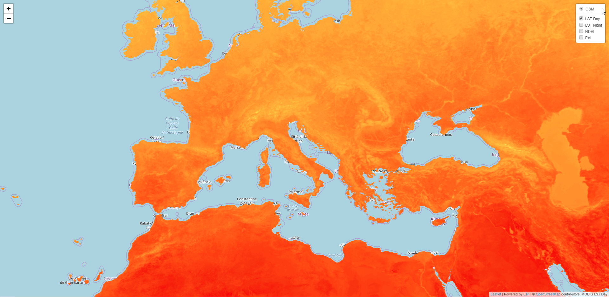

# ModisDownloader
## Descrizione
Collezione di script Python per lo scarico e l'estrazione in formato TIFF dei dati MODIS relativi a temperatura (MOD11C3) e indici di vegetazione (MOD13C2).

## Utilizzo
All'interno della directory principale del progetto, creare:
  * la directory *downloaded_hdf*
  * la directory *output_tiff*
  * il file **config.py** in cui siano definite, sotto forma di dizionari, le credenziali di accesso al servizio e i limiti temporali dei dati MODIS da scaricare. Es:
```
credentials = {
    'username': 'myUsername', 
    'password': 'myPassword!'
}

data = {
    'year':'2015',
    'months': ['01', '02', '03', '04', '05', '06', '07', '08', '09', '10', '11', '12']
}
```
  * Lanciare lo script **clean.py** se si desidera pulire le directory di lavoro prima di cominciare
  * Lanciare lo script **download_hdf.py** per scaricare gli HDF nella directory di download
  * Lanciare lo script **extract_to_tiff.py** per estrarre i TIFF nella directory di estrazione
  * Lanciare lo script **copy_on_server.py** per copiare i TIFF nella directory di destinazione sul server
  

